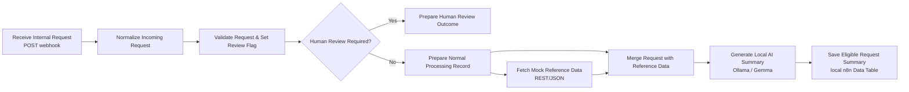

# AI-Assisted Internal Request Triage (n8n)

> **Status: personal learning portfolio prototype.** A public-safe n8n workflow that accepts fictional internal requests, applies transparent safety rules, enriches eligible requests with mock REST/JSON data, creates a local LLM summary, and saves the result to local n8n storage.

## What problem it explores

Internal requests can be incomplete, sensitive, or routine. This prototype demonstrates a conservative automation pattern: explicit rules and human review decide the route; an LLM only creates a concise summary **after** a request has been determined eligible for normal processing.

All examples are fictional. It does not connect to an employer system, approve a request, or use real personal/customer data.

## Architecture



## Safety model

A request is routed to human review if it:

- has a missing or malformed required value (`requester`, `request_type`, `description`, or `needed_by`);
- is an `access_request`, `payment_request`, or `supplier_request`; or
- has an unknown request type.

The model has **no routing, approval, payment, access, or supplier-action authority**. It receives only requests already routed to normal processing and returns a short, neutral summary.

## What it demonstrates

- `POST` webhook intake with JSON
- n8n field mapping and small JavaScript validation
- explainable, rule-based routing with a visible human-review branch
- REST/JSON integration using a credential-free mock endpoint
- merging original business data with an API response
- local LLM use through Ollama (`gemma4:e4b-mlx` during development)
- persistent workflow output using n8n Data Tables

## Workflow notes

### Mock API

The normal route calls:

```text
GET https://jsonplaceholder.typicode.com/todos/1
```

This is a public dummy endpoint used solely to demonstrate REST/JSON mechanics. Its values have no business meaning.

### Local LLM

Development used Ollama with `gemma4:e4b-mlx` and temperature `0.2`. The exported workflow deliberately has **no credential reference**. After importing, create your own Ollama credential and select an installed local chat model.

### Local Data Table

The final node saves `requester`, `request_type`, `needed_by`, `route`, and `llm_summary` to a local n8n Data Table. Data Tables are instance/project-specific, so after import create a table named `eligible_request_summaries` with those five String columns, then select it in **Save Eligible Request Summary**.

## Tested evidence

| Synthetic scenario | Expected result | Evidence status |
|---|---|---|
| Complete `information_request` | Normal route → mock API → merge → local LLM summary → saved row | Verified in n8n UI |
| Complete `access_request` | Human review; API, LLM, and Data Table bypassed | Verified in n8n UI |
| Unknown request type | Human review | Rule implemented; repeat in UI after import |
| Malformed required value | Human review without a `.trim()` error | Rule implemented; repeat in UI after import |

See [`data/test-fixtures.json`](data/test-fixtures.json) and [`docs/limitations-and-human-review.md`](docs/limitations-and-human-review.md).

## Run locally

1. Start n8n locally: `npx n8n`.
2. Import [`workflows/internal-request-triage.json`](workflows/internal-request-triage.json).
3. Create/select your local Ollama credential in n8n and choose an installed model. Keep any machine-specific connection address out of public files.
4. Create the local Data Table described above and select it in the final node.
5. Keep the supplied fictional pinned `information_request` or send a matching `POST` JSON payload to the webhook.
6. Execute and inspect the normal route, LLM output, and saved Data Table row.

## Limitations

- This is not a production deployment and does not authenticate the webhook.
- The mock API has no configured failure-to-review fallback yet.
- The Data Table insert is not idempotent; retrying the same request may create duplicate rows.
- The local form/UI intake is a future enhancement; this repository focuses on the webhook-based automation core.
- Local Ollama model availability and quality depend on the importing machine.

## Repository safety

The committed workflow is a reviewed portfolio copy. It excludes credential references, webhook IDs, workflow/version/instance IDs, local Data Table IDs, local URLs, and real data.
